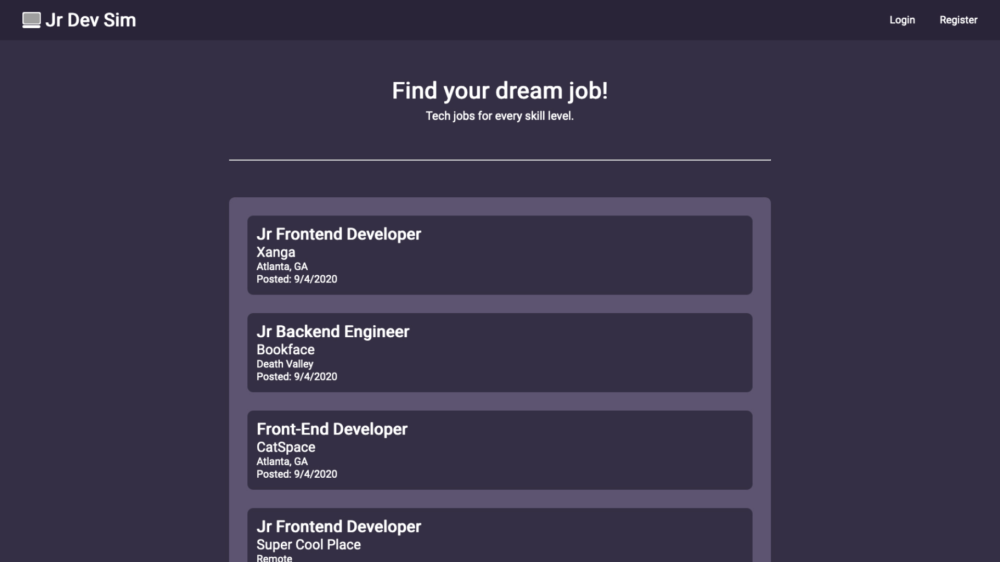

# jr-dev-sim

## This is a MERN Stack App

Jr Dev Sim is what my experience searching for an entry level developer job has been like thus far. Just a dash of bitters here I suppose.

MongoDB Atlas for the database. Express and Node handle the API routes. Mongoose is used to create the user and job schemas. React on the frontend with styled components. Axios makes the API requests.

Jr Dev Sim allows for CRUD operations. You can only see and apply for jobs if you aren't logged in. If you ARE logged in, you can create a job listing, update an existing job listing, and delete a job listing.

